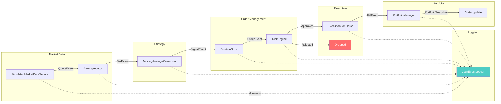

# Event-Driven Trading System

A real-time, event-driven trading simulation built in C# / .NET 10. The system subscribes to simulated market data and processes it through a deterministic pipeline, from raw quotes to executed trades, with full JSONL logging and byte-for-byte reproducible replay.

The strategy (moving average crossover) is intentionally simple. **The architecture is the product.**

## What This Repo Demonstrates

- Composable, event-first system boundaries
- Deterministic event replay for debugging and validation
- Risk-gated order flow from signal to execution
- Portfolio accounting with explicit cost tracking

## Determinism Guarantees

- Uses `decimal` arithmetic throughout core financial paths.
- Uses timestamp-driven event sequencing (not wall-clock timing) for replay consistency.
- Uses counter-based IDs for orders/fills to keep outputs stable across runs.

## Architecture



### Event Flow

```
QuoteEvent → BarAggregator → BarEvent → Strategy → SignalEvent
  → PositionSizer → OrderEvent → RiskEngine → RiskDecision
    → ExecutionSimulator → FillEvent → PortfolioManager → PortfolioSnapshot
```

Every event implements `IEvent` with a `Timestamp` and `EventType` discriminator. All arithmetic uses `decimal` for deterministic results — never `double`.

## Features

- **Deterministic replay** — Feed the same quotes in, get byte-for-byte identical output. Verified via diff of all non-Quote events.
- **6-check risk engine** — MaxPosition, MaxDailyLoss, MaxDrawdown, MaxTradesPerMinute, MaxDailyTurnover, and per-symbol LossCooldown.
- **Full portfolio accounting** — Weighted average cost basis, realized/unrealized PnL, high water mark, drawdown tracking, position flipping (long→short).
- **JSONL event logging** — Every event logged with a type discriminator for polymorphic deserialization. Sessions are fully replayable.
- **Execution simulation** — Fill at bid/ask with configurable slippage (bps), per-share or bps-based fees, and simulated latency.
- **Polished CLI output** — ASCII banner, periodic live ticker, color-coded PnL, formatted end-of-day report.
- **Demo mode** — Rich terminal UI powered by [Spectre.Console](https://spectreconsole.net/) with live-updating positions table, event ticker, and stats dashboard.

## Quick Start

### Prerequisites

- [.NET 10 SDK](https://dotnet.microsoft.com/download/dotnet/10.0)

### Restore dependencies

```bash
dotnet restore
```

### Run a live session

```bash
# Default 2-minute session
dotnet run --project TradingSystem.Runner

# Custom duration (in seconds)
dotnet run --project TradingSystem.Runner -- --duration 120
```

### Run demo mode (Spectre.Console UI)

```bash
# 60-second session with live dashboard
dotnet run --project TradingSystem.Runner -- --demo

# Demo with custom duration
dotnet run --project TradingSystem.Runner -- --demo --duration 90
```

### Replay a session

```bash
# Replay from a logged session file
dotnet run --project TradingSystem.Runner -- --replay logs/session_2025-01-15_14-30-00.jsonl
```

Replay mode reprocesses the saved event stream and prints the same report/output shape as live mode, making regressions easier to diagnose.

### Run tests

```bash
dotnet test
```

## CLI Options

| Flag | Description | Example |
|------|-------------|---------|
| `--duration <seconds>` | Session length in seconds | `--duration 120` |
| `--demo` | Runs Spectre.Console dashboard mode | `--demo` |
| `--replay <file>` | Replays a prior JSONL session file | `--replay logs/session_2025-01-15_14-30-00.jsonl` |

## Project Structure

```
.
├── TradingSystem.slnx                  # .NET 10 solution
├── TradingSystem.Core/                 # Shared types, interfaces, models
│   ├── Enums/                          #   Side, SignalType, RiskAction
│   ├── Events/                         #   IEvent, QuoteEvent, BarEvent, SignalEvent,
│   │                                   #   OrderEvent, FillEvent, RiskDecision, PortfolioSnapshot
│   ├── Interfaces/                     #   IMarketDataSource, IStrategy, IRiskEngine, etc.
│   ├── Models/                         #   Position, PositionInfo, PortfolioState, RiskConfig
│   └── MetricsTracker.cs              #   Pipeline counters, cost tracking, rejection breakdown
├── TradingSystem.MarketData/           # Simulated price feed (random walk, Box-Muller)
├── TradingSystem.Strategy/             # BarAggregator + MA Crossover (circular buffer SMA)
├── TradingSystem.Portfolio/            # PositionSizer + PortfolioManager (cost basis, PnL)
├── TradingSystem.Risk/                 # RiskEngine (6 independent checks)
├── TradingSystem.Execution/            # ExecutionSimulator (slippage, fees, latency)
├── TradingSystem.Logging/              # JsonEventLogger + EventReplayer (JSONL, polymorphic)
├── TradingSystem.Runner/               # Entry point, event wiring, CLI output, session report
└── TradingSystem.Tests/                # 78 xUnit tests (Risk, Execution, Portfolio)
```

## Sample Output

### Demo Mode (`--demo`)

```
────────────────── TRADING SYSTEM  elapsed 00:42  remaining 00:18 ──────────────────

┌─ Positions ──────────────────────────────────────────────────────────────────┐
│  Symbol   Side    Qty    Avg Cost    Mkt Price    Mkt Value   Unrealized P&L │
│ ──────────────────────────────────────────────────────────────────────────── │
│   AAPL    SHORT    54    $185.53      $185.48     $10,015.92       +$2.70    │
│   GOOGL   LONG     57    $175.12      $175.08      $9,979.56      -$2.28    │
│   MSFT    SHORT    24    $420.05      $420.12     $10,082.88      -$1.68    │
└──────────────────────────────────────────────────────────────────────────────┘
┌─ Stats ──────────────────────────────────────────────────────────────────────┐
│    Equity         Daily P&L       Max Drawdown   Fills   Signals  Reject Rate│
│  $99,971.30   -$28.70 (-0.03%)      0.04%          5       8       16.7%     │
└──────────────────────────────────────────────────────────────────────────────┘
┌─ Recent Events ──────────────────────────────────────────────────────────────┐
│  22:15:32.450  SIGNAL  AAPL   SHORT                                          │
│  22:15:32.450  FILL    AAPL  SELL 54 @ $185.53                               │
│  22:15:38.200  SIGNAL  GOOGL  LONG                                           │
│  22:15:38.200  FILL    GOOGL BUY 57 @ $175.12                                │
│  22:15:40.100  REJECT  MSFT  SELL 24  [LossCooldown]                         │
│  22:15:44.300  SIGNAL  MSFT   SHORT                                          │
│  22:15:44.300  FILL    MSFT  SELL 24 @ $420.05  PnL: +$8.42                  │
└──────────────────────────────────────────────────────────────────────────────┘
```

### Startup

```
  ████████╗██████╗  █████╗ ██████╗ ██╗███╗   ██╗ ██████╗
  ╚══██╔══╝██╔══██╗██╔══██╗██╔══██╗██║████╗  ██║██╔════╝
     ██║   ██████╔╝███████║██║  ██║██║██╔██╗ ██║██║  ███╗
     ██║   ██╔══██╗██╔══██║██║  ██║██║██║╚██╗██║██║   ██║
     ██║   ██║  ██║██║  ██║██████╔╝██║██║ ╚████║╚██████╔╝
     ╚═╝   ╚═╝  ╚═╝╚═╝  ╚═╝╚═════╝ ╚═╝╚═╝  ╚═══╝ ╚═════╝
     Event-Driven Trading System                     v1.0

  ── Configuration ───────────────────────────────────────
  Mode:               LIVE (simulated)
  Symbols:            AAPL, MSFT, GOOGL
  Starting Equity:    $100,000.00
  Strategy:           MA Crossover (10/30)
  Bar Duration:       1s
  Risk Limits:        15% max position | 2% max daily loss | 5% max drawdown
  Execution:          1.0 bps slippage | $0.005/share fee
  Duration:           120s
```

### Live Ticker

```
  [00:32]  Bars: 96     Signals: 4    Fills: 4    Rejects: 0    PnL: -$12.40 (-0.01%)
  FILL    AAPL BUY 54 @ $185.53
  [00:34]  Bars: 102    Signals: 5    Fills: 5    Rejects: 1    PnL: -$28.15 (-0.03%)
  REJECT  MSFT SELL 24  [LossCooldown]
  FILL    GOOGL BUY 57 @ $175.12  PnL: +$8.42
```

### End-of-Day Report

```
════════════════════════════════════════════════════════════
  TRADING SESSION REPORT — 2025-01-15
════════════════════════════════════════════════════════════

  Duration:           0h 02m 00s
  Symbols Traded:     AAPL, MSFT, GOOGL

  ── Pipeline Stats ──────────────────────────────────────
  Quotes Received:         1,440
  Bars Generated:            240
  Signals Emitted:            12
  Orders Created:             12
  Orders Filled:              10
  Orders Rejected:             2  (16.7% reject rate)

  ── Performance ─────────────────────────────────────────
  Starting Equity:       $100,000.00
  Ending Equity:          $99,847.30
  Daily P&L:                -$152.70  (-0.15%)
  Realized P&L:              -$84.20
  Unrealized P&L:            -$68.50
  Max Drawdown:              0.18%
  High Water Mark:       $100,012.00

  ── Costs ───────────────────────────────────────────────
  Total Fees:                 $2.85
  Total Slippage:             $6.12
  Total Costs:                $8.97
════════════════════════════════════════════════════════════
```

## Configuration

All parameters are set in `Program.cs`:

| Parameter | Default | Description |
|-----------|---------|-------------|
| `TickIntervalMs` | 250 | Milliseconds between quote ticks |
| `Volatility` | 0.02% | Per-tick price volatility |
| `SpreadBps` | 3 bps | Average bid-ask spread |
| `BarDuration` | 1s | OHLC bar aggregation period |
| `FastMAPeriod` | 10 | Fast moving average period (bars) |
| `SlowMAPeriod` | 30 | Slow moving average period (bars) |
| `TargetPositionPct` | 10% | Target position size as % of equity |
| `MaxPositionPct` | 15% | Risk limit: max position size |
| `MaxDailyLossPct` | 2% | Risk limit: max daily loss |
| `MaxDrawdownPct` | 5% | Risk limit: max drawdown from HWM |
| `MaxTradesPerMinute` | 10 | Risk limit: fill rate cap |
| `LossCooldown` | 30s | Risk limit: pause after realized loss |
| `SlippageBps` | 1 bps | Simulated market impact |
| `FeePerShare` | $0.005 | Per-share commission |
| `StartingCash` | $100,000 | Initial portfolio equity |

## Module Responsibilities

- `TradingSystem.MarketData`: quote generation and spread modeling
- `TradingSystem.Strategy`: bar aggregation and FMA/SMA signal generation
- `TradingSystem.Portfolio`: sizing + position/cash/PnL accounting
- `TradingSystem.Risk`: pre-trade validation checks and rejection metadata
- `TradingSystem.Execution`: fill simulation with slippage/fees/latency
- `TradingSystem.Logging`: JSONL persistence and deterministic replay support

## Testing

78 unit tests across three modules:

```
$ dotnet test

Passed!  - Failed: 0, Passed: 78, Skipped: 0, Total: 78

  RiskEngineTests ............ 37 tests
    ├── MaxPosition checks (approve/reject, resulting position)
    ├── MaxDailyLoss checks (approve/reject, boundary)
    ├── MaxDrawdown checks (approve/reject)
    ├── MaxTradesPerMinute checks (sliding window, expiry)
    ├── MaxDailyTurnover checks (cumulative tracking)
    ├── LossCooldown checks (per-symbol isolation, expiry)
    └── Combined scenarios, metadata preservation

  ExecutionSimulatorTests .... 15 tests
    ├── Fill pricing (BUY at ask, SELL at bid)
    ├── Slippage (adverse direction, cost calculation)
    ├── Fee models (per-share, bps-based)
    └── Latency simulation, deterministic IDs

  PortfolioManagerTests ...... 22 tests
    ├── Opening, adding, reducing, closing positions
    ├── Position flipping (long→short, short→long)
    ├── Cash accounting (BUY deducts, SELL credits)
    ├── Weighted average cost basis
    ├── Realized/unrealized PnL
    ├── High water mark and drawdown
    └── Multi-symbol isolation, mark-to-market
```

## Troubleshooting

- If output seems inconsistent between runs, remove `logs/` and run a fresh session before replaying.
- If replay fails to parse, verify the file is newline-delimited JSON (`.jsonl`) generated by this runner.

## Design Decisions

- **`decimal` everywhere** — No `double` or `float`. Deterministic arithmetic is essential for replay fidelity.
- **Event timestamps, not wall clock** — BarAggregator uses event timestamps for bar boundaries, making replay produce identical bars regardless of execution speed.
- **Counter-based IDs** — `ORD-000001`, `FILL-000001` instead of GUIDs, ensuring deterministic output across runs.
- **All risk checks always run** — Even after a failure, remaining checks execute and record results. The first failure becomes the rejection reason.
- **Separate mutable/immutable models** — `Position` (mutable, internal) vs `PositionInfo` (immutable record, for snapshots and logging).

## License

MIT
